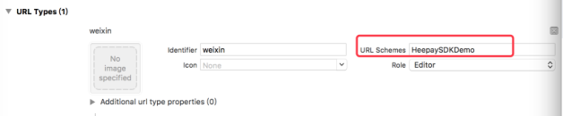

## 微信扫码


> 请求URL:`https://pay.heepay.com/Payment/Index.aspx`

> 请求方式:`POST/GET`   

> 是否需要证书：`否`


- 协议参数

<table data-hy-role="doctbl">
    <th>参数</th>
    <th>类型</th>
    <th>是否必填</th>
    <th>最大长度</th>
    <th width="220">描述</th>
    <th width="163">示例值</th>
</tr>
<tr>
    <td>version</td>
    <td>int</td>
    <td>是</td>
    <td>-</td>
    <td>当前接口版本号1</td>
    <td>1</td>
</tr>
<tr>
    <td>pay_type</td>
    <td>int</td>
    <td>是</td>
    <td>-</td>
    <td>支付类型30</td>
    <td>30</td>
</tr>
<tr>
    <td>agent_id</td>
    <td>int</td>
    <td>是</td>
    <td>16</td>
    <td>商户编号，（汇付宝商户内码：七位整数数字）</td>
    <td>1664502</td>
</tr>
<tr>
    <td>agent_bill_id</td>
    <td>String</td>
    <td>是</td>
    <td>32</td>
    <td>商户系统内部的订单号（要保证唯一）</td>
    <td>acbacb123456</td>
</tr>
<tr>
    <td>agent_bill_time</td>
    <td>String</td>
    <td>是</td>
    <td>14</td>
    <td>提交单据的时间yyyyMMddHHmmss，该参数共计14位，当时不满14位时，在后面加0补足14位</td>
    <td>20100225102000</td>
</tr>
<tr>
    <td>pay_amt</td>
    <td>decimal</td>
    <td>是</td>
    <td>16</td>
    <td>订单总金额 不可为空，取值范围（0.01到10000000.00），单位：元，小数点后保留两位。</td>
    <td>10.00</td>
</tr>
<tr>
    <td>notify_url</td>
    <td>String</td>
    <td>是</td>
    <td>128</td>
    <td>支付后返回的商户处理页面，URL参数是以http://或https://开头的完整URL地址(后台处理)，提交的url地址必须外网能访问到，否则无法通知商户。值可以为空，但不可以为null。</td>
    <td>https://..</td>
</tr>
<tr>
    <td>return_url</td>
    <td>String</td>
    <td>是</td>
    <td>128</td>
    <td>支付后返回的商户显示页面，URL参数是以http://或https://开头的完整URL地址(前台显示)，原则上该参数与notify_url提交的参数不一致。值可以为空，但不可以为null。</td>
    <td>https://..</td>
</tr>
<tr>
    <td>user_ip</td>
    <td>String</td>
    <td>是</td>
    <td>32</td>
    <td>用户所在客户端的真实ip其中的“.”替换为“_” 。因为近期我方发现用户在提交数据时，user_ip在网络层被篡改，导致签名错误，所以我们规定使用这种格式。</td>
    <td>127_127_12_12</td>
</tr>
<tr>
    <td>goods_name</td>
    <td>String</td>
    <td>是</td>
    <td>50</td>
    <td>商品名称，不能为空（不参加签名）</td>
    <td>100元话费</td>
</tr>
<tr>
    <td>goods_num</td>
    <td>int</td>
    <td>否</td>
    <td>20</td>
    <td>产品数量（不参加签名）</td>
    <td>1</td>
</tr>
<tr>
    <td>remark</td>
    <td>String</td>
    <td>是</td>
    <td>50</td>
    <td>商户自定义，原样返回,可以为空。（不参加签名）</td>
    <td>123</td>
</tr>
<tr>
    <td>goods_note</td>
    <td>String</td>
    <td>否</td>
    <td>50</td>
    <td>支付说明，（不参加签名）</td>
    <td>购买商品</td>
</tr>
<tr>
    <td>timestamp</td>
    <td>int</td>
    <td>否</td>
    <td>16</td>
    <td>时间戳，北京时间1970/1/1 0点到现在的毫秒值，订单在+-1min内有效，超过时间订单不能提交。如果传此参数，此参数也需要参与签名，参数加在key后面</td>
    <td>1596449885500</td>
</tr>
<tr>
    <td>sign_type</td>
    <td>String</td>
    <td>是</td>
    <td>32</td>
    <td>签名类型，MD5\RSA\RSA2</td>
    <td>MD5</td>
</tr>
<tr>
    <td>sign</td>
    <td>String</td>
    <td>是</td>
    <td>-</td>
    <td>MD5\RSA\RSA2签名结果</td>
    <td>5b30503b791628b580ed5d42e580ad92</td>
</tr>
</table>

```text
友情提示：以上请求参数最好都是小写形式的，汉字格式编码均为GBK，如agent_bill_id=ABC123456，最好转化为agent_bill_id=abc123456，汉字格式在开发中无法确认的话建议进行url编码后再进行数据传递，这样开发会比较顺利。
```

请求示例（GET方式）：

```text
https://pay.heepay.com/Payment/Index.aspx?version=1&agent_id=1234567&agent_bill_id=123456789&agent_bill_time=20170527102250&pay_type=30&pay_amt=0.1&notify_url=http://www.xxx.com/heepay1.aspx&return_url=http://www.xxx.com/heepay2.aspx&user_ip=192_168_1_1&goods_name=%b2%e2%ca%d4&goods_num=1&goods_note=%b2%e2%ca%d4&remark=%b2%e2%ca%d4&sign=5b30503b791628b580ed5d42e580ad92
```

签名规则说明
参数签名顺序（必须按照此顺序组织签名）说明及示例：

```text
sign=MD5(version=1&agent_id=1234567&agent_bill_id=123456789&agent_bill_time=20170527102250&pay_type=30&pay_amt=0.1&notify_url=http://www.xxx.com/heepay1.aspx&return_url=http://www.xxx.com/heepay2.aspx&user_ip=192_168_1_1&key=1234567890)
```

```text
注意：以上拼凑值不要有空格！
使用标准MD5算法对该字符串进行加密，即为我们所需的订单MD5校验码，将其写入sign字段即可。
MD5对比验证：字符串ABCabc123456生成的MD5字符串为123785419aed644018cfef182148e895，MD5前的签名串编码是UTF-8
```


## 微信H5

- 支付接口


> 请求URL:`https://Pay.Heepay.com/DirectPay/applypay.aspx`

> 请求方式:`POST/GET`   

> 是否需要证书：`否`


- 协议参数

<table data-hy-role="doctbl">
    <th>参数</th>
    <th>类型</th>
    <th>是否必填</th>
    <th>最大长度</th>
    <th width="220">描述</th>
    <th width="163">示例值</th>
</tr>
<tr>
    <td>version</td>
    <td>int</td>
    <td>是</td>
    <td>-</td>
    <td>当前接口版本号1</td>
    <td>1</td>
</tr>
<tr>
    <td>scene</td>
    <td>int</td>
    <td>是</td>
    <td>-</td>
    <td>支付方式，h5表示h5，qr表示扫码（如支付类型为扫码，payment_mode传UnifiedOrder返回二维码url），jsapi表示公众号（微信内拉起），app表示app拉起支付(值均为小写)</td>
    <td>qr</td>
</tr>
<tr>
    <td>pay_type</td>
    <td>int</td>
    <td>是</td>
    <td>-</td>
    <td>支付类型30</td>
    <td>30</td>
</tr>
<tr>
    <td>agent_id</td>
    <td>int</td>
    <td>是</td>
    <td>16</td>
    <td>商户编号，（汇付宝商户内码：七位整数数字）</td>
    <td>1664502</td>
</tr>
<tr>
    <td>agent_bill_id</td>
    <td>String</td>
    <td>是</td>
    <td>32</td>
    <td>商户系统内部的订单号（要保证唯一）</td>
    <td>acbacb123456</td>
</tr>
<tr>
    <td>agent_bill_time</td>
    <td>String</td>
    <td>是</td>
    <td>14</td>
    <td>提交单据的时间yyyyMMddHHmmss，该参数共计14位，当时不满14位时，在后面加0补足14位</td>
    <td>20100225102000</td>
</tr>
<tr>
    <td>pay_amt</td>
    <td>decimal</td>
    <td>是</td>
    <td>16</td>
    <td>订单总金额 不可为空。小数点后保留两位</td>
    <td>10.00</td>
</tr>
<tr>
    <td>notify_url</td>
    <td>String</td>
    <td>是</td>
    <td>128</td>
    <td>支付后返回的商户处理页面，URL参数是以http://或https://开头的完整URL地址(后台处理)，提交的url地址必须外网能访问到，否则无法通知商户。值可以为空，但不可以为null。</td>
    <td>https://..</td>
</tr>
<tr>
    <td>return_url</td>
    <td>String</td>
    <td>是</td>
    <td>128</td>
    <td>支付后返回的商户显示页面，URL参数是以http://或https://开头的完整URL地址(前台显示)，原则上该参数与notify_url提交的参数不一致。值可以为空，但不可以为null。</td>
    <td>https://..</td>
</tr>
<tr>
    <td>user_ip</td>
    <td>String</td>
    <td>是</td>
    <td>32</td>
    <td>用户所在客户端的真实ip其中的“.”替换为“_” 。因为近期我方发现用户在提交数据时，user_ip在网络层被篡改，导致签名错误，所以我们规定使用这种格式。</td>
    <td>127_127_12_12</td>
</tr>
<tr>
    <td>goods_name</td>
    <td>String</td>
    <td>是</td>
    <td>50</td>
    <td>商品名称，不能为空（不参加签名）</td>
    <td>100元话费</td>
</tr>
<tr>
    <td>remark</td>
    <td>String</td>
    <td>是</td>
    <td>50</td>
    <td>商户自定义，原样返回,可以为空。</td>
    <td>123</td>
</tr>
<tr>
    <td>goods_note</td>
    <td>String</td>
    <td>否</td>
    <td>50</td>
    <td>对私分账参数，记录内码:分账金额,记录内码:分账金额。商家后台-分账配置查询-记录内码，分账总金额=订单金额-(订单金额*费率)，金额只传入小数点后2位的值，第三位舍去留在通道里，如对公结算此参数传空（不参与签名）</td>
    <td>1207:30,1208:20</td>
</tr>
<tr>
    <td>payment_mode</td>
    <td>String</td>
    <td>是</td>
    <td>50</td>
    <td>收银台=cashier，接口=payment_mode（目前支持扫码，app）</td>
    <td>购买商品</td>
</tr>
<tr>
    <td>meta_option</td>
    <td>String</td>
    <td>是</td>
    <td>128</td>
    <td>{“s”:”WAP”,”n”:”网站名”,”id”:”首页URL”}汉字编码GBK，需要base64</td>
    <td>eyJzIjoiV0FQIiwibiI6Ir6ptqu52c34IiwiaWQiOiJodHRwczovL20uamQuY29tIn0%3d</td>
</tr>
<tr>
    <td>bank_card_type</td>
    <td>int</td>
    <td>是</td>
    <td>16</td>
    <td>银行类型：未知=-1，储蓄卡=0，信用卡=1。</td>
    <td>-1</td>
</tr>
<tr>
    <td>timestamp</td>
    <td>int</td>
    <td>否</td>
    <td>16</td>
    <td>时间戳，传了订单有效时间上下1min，从1970年1月1日0时到现在的毫秒数，传了参与签名，签名位置在key前面。</td>
    <td>1596449885500</td>
</tr>
<tr>
    <td>sign_type</td>
    <td>String</td>
    <td>是</td>
    <td>32</td>
    <td>签名类型，MD5\RSA\RSA2</td>
    <td>MD5</td>
</tr>
<tr>
    <td>sign</td>
    <td>String</td>
    <td>是</td>
    <td>-</td>
    <td>MD5\RSA\RSA2签名结果</td>
    <td>5b30503b791628b580ed5d42e580ad92</td>
</tr>
</table>

```text
友情提示：以上请求参数最好都是小写形式的，汉字格式编码均为GBK，如agent_bill_id=ABC123456，最好转化为agent_bill_id=abc123456，汉字格式在开发中无法确认的话建议进行url编码后再进行数据传递，这样开发会比较顺利。
```

meta_option参数说明：

```text
meta_option添加在请求参数中（不参与签名）
说明：
app包装微信H5（ios/Android）、微信wap
ios:(meta_option="{"s":"IOS","n":"应用在App Store中唯一应用名","id":"IOS应用唯一标识"}";)
Android:(meta_option="{"s":"Android","n":"应用在安卓分发市场中的应用名","id":"应用在一台设备上的唯一标识在manifest文件里面的声明"}";)
WAP网站：(meta_option="{"s":"WAP","n":"WAP网站名","id":"WAP网站的首页URL"}";)WAP网址必须保证公网能正常访问
示例：
wap网站：(meta_option="{"s":"WAP","n":"京东官网","id":"https://m.jd.com"}";)
s=应用场景
n=应用名称（应用名称或者WAP网站名称）
id=IOS应用唯一标识或者。Android应用在一台设备上的唯一标识在manifest文件里面的声明或者WAP网站的首页URL
注意：此参数需要GBK编码下base64，然后urlencode。
meta_option示例：
原始数据：meta_option={"s":"WAP","n":"京东官网","id":"https://m.jd.com"}
加密后结果：meta_option=eyJzIjoiV0FQIiwibiI6Ir6ptqu52c34IiwiaWQiOiJodHRwczovL20uamQuY29tIn0%3d
```


请求示例（GET方式）：

```text
https://Pay.Heepay.com/DirectPay/applypay.aspx?version=1&scene=h5&payment_mode=cashier&agent_id=1664502&agent_bill_id=20170705170201&agent_bill_time=20170705170201&pay_type=30&pay_amt=0.01&notify_url=http://xxxxx/test/notify.aspx&return_url=http://xxxxx/test/return.aspx&user_ip=115_29_78_146&goods_name=%b2%e2%ca%d4&goods_num=1&goods_note=&remark=%b2%e2%ca%d4&meta_option=eyJzIjoid2FwIiwibiI6IrLiytQiLCJpZCI6Ind3dy5jZXNoaS5jb20ifQ%3d%3d&bank_card_type=-1&sign=bc63bc982685ba82cba809e1078ffcac
```

签名规则说明
参数签名顺序（必须按照此顺序组织签名）说明及示例：

```text
sign=md5(version=1&agent_id=1959138&agent_bill_id=20180613134150&agent_bill_time=20180613134150&pay_type=30&pay_amt=5&notify_url=https://Pay.Heepay.com/Test/TestReceive.aspx&return_url=https://Pay.Heepay.com/Test/TestReturn.aspx&user_ip=115_29_78_14&bank_card_type=-1&remark=41818032&key=B3AD032C10AC4AEF9D2A382D)
```

```text
注意：以上拼凑值不要有空格！
使用标准MD5算法对该字符串进行加密，即为我们所需的订单MD5校验码，将其写入sign字段即可。
MD5对比验证：字符串ABCabc123456生成的MD5字符串为123785419aed644018cfef182148e895，MD5前的签名串编码是UTF-8
```


- **支付请求同步返回**

返回text格式
```text
示例：
<?text version="1.0" encoding="utf-8"?>
<root>
<ret_code>0000</ret_code>
<ret_msg>创建支付单成功</ret_msg>
<redirectUrl><![CDATA[https://hykjh5.heemoney.com/DirectPay/WxPayment.aspx?stid=H20080330000000H_04a99c632bcb1969249f4501ce2d7ba4]]></redirectUrl>
<sign><![CDATA[b4715b0dfa857a44075e45eabbef6c40]]></sign>
</root>
```

- 返回参数


<table data-hy-role="doctbl">
    <th>参数</th>
    <th>类型</th>
    <th>是否必填</th>
    <th>最大长度</th>
    <th width="220">描述</th>
    <th width="163">示例值</th>
</tr>
<tr>
    <td>ret_code</td>
    <td>string</td>
    <td>是</td>
    <td>16</td>
    <td>0000返回成功</td>
    <td>0000</td>
</tr>
<tr>
    <td>ret_msg</td>
    <td>string</td>
    <td>是</td>
    <td>32</td>
    <td>返回码信息提示</td>
    <td>创建支付单成功</td>
</tr>
<tr>
    <td>redirectUrl</td>
    <td>string</td>
    <td>是</td>
    <td>128</td>
    <td>返回的URL，访问后调起支付</td>
    <td>https://hykjh5.heemoney.com/DirectPay/WxPayment.aspx?stid=H20080330000000H_04a99c632bcb1969249f4501ce2d7ba4</td>
</tr>
<tr>
    <td>sign</td>
    <td>String</td>
    <td>是</td>
    <td>32</td>
    <td>MD5签名结果</td>
    <td>5b30503b791628b580ed5d42e580ad92</td>
</tr>
</table>


签名规则说明
参数签名顺序（必须按照此顺序组织签名）说明及示例：

```text
sign=md5(redirectUrl=https://hykjh5.heemoney.com/DirectPay/WxPayment.aspx?stid=H20080330000000H_04a99c632bcb1969249f4501ce2d7ba4&ret_code=0000&ret_msg=创建支付单成功&key=CC08C5E3E69F4E6B85F1DC0B)
```

```text
注意：以上拼凑值不要有空格，返回数据A-Z+KEY排序验签！
使用标准MD5算法对该字符串进行加密，即为我们所需的订单MD5校验码，将其写入sign字段即可。
MD5对比验证：字符串ABCabc123456生成的MD5字符串为123785419aed644018cfef182148e895，MD5前的签名串编码是UTF-8
```


 ### 微信H5查询接口


> 请求URL:`https://jhpay.heemoney.com/DirectPay/query.aspx`

> 请求方式:`POST/GET`   

> 是否需要证书：`否`


- 协议参数

<table data-hy-role="doctbl">
    <th>参数</th>
    <th>类型</th>
    <th>是否必填</th>
    <th>最大长度</th>
    <th width="220">描述</th>
    <th width="163">示例值</th>
</tr>
<tr>
    <td>version</td>
    <td>int</td>
    <td>是</td>
    <td>-</td>
    <td>当前接口版本号1</td>
    <td>1</td>
</tr>
<tr>
    <td>agent_id</td>
    <td>int</td>
    <td>是</td>
    <td>16</td>
    <td>商户编号，（汇付宝商户内码：七位整数数字）</td>
    <td>1664502</td>
</tr>
<tr>
    <td>agent_bill_id</td>
    <td>String</td>
    <td>是</td>
    <td>32</td>
    <td>商户系统内部的订单号（要保证唯一）</td>
    <td>acbacb123456</td>
</tr>
<tr>
    <td>agent_bill_time</td>
    <td>String</td>
    <td>是</td>
    <td>14</td>
    <td>提交单据的时间yyyyMMddHHmmss，该参数共计14位，当时不满14位时，在后面加0补足14位</td>
    <td>20200225102000</td>
</tr>
<tr>
    <td>remark</td>
    <td>String</td>
    <td>是</td>
    <td>50</td>
    <td>商户自定义，原样返回,可以为空。</td>
    <td>123</td>
</tr>
<tr>
    <td>return_mode</td>
    <td>String</td>
    <td>是</td>
    <td>50</td>
    <td>查询结果返回类型，1=字符串返回</td>
    <td>1</td>
</tr>
<tr>
    <td>sign</td>
    <td>String</td>
    <td>是</td>
    <td>-</td>
    <td>MD5\RSA\RSA2签名结果</td>
    <td>5b30503b791628b580ed5d42e580ad92</td>
</tr>
</table>

请求示例（GET方式）：

```text
https://Pay.Heepay.com/DirectPay/query.aspx?version=1&agent_id=2083328&agent_bill_id=152007271016000010000000&agent_bill_time=20191217153011&remark=123&return_mode=1&sign=c3c4a5627ba7c19c395d12bd61673e53
```

签名规则说明
参数签名顺序（必须按照此顺序组织签名）说明及示例：

```text
sign=md5(version=1&agent_id=2083328&agent_bill_id=1520072710160000101970001457&agent_bill_time=20191217153011&key=852B4A10455E49F123EEFCB1)
```

```text
注意：以上拼凑值不要有空格！
使用标准MD5算法对该字符串进行加密，即为我们所需的订单MD5校验码，将其写入sign字段即可。
MD5对比验证：字符串ABCabc123456生成的MD5字符串为123785419aed644018cfef182148e895，MD5前的签名串编码是UTF-8
```


- **查询返回**

数据将以字符串形式在同一会话中同步返回
```text
例如：
<?text version="1.0" encoding="utf-8"?>
<root>
<ret_code>0000</ret_code>
<ret_msg>查询单据支付完</ret_msg>
<agent_id><![CDATA[2083328]]></agent_id>
<agent_bill_id><![CDATA[2018101014402303]]></agent_bill_id>
<jnet_bill_no><![CDATA[H18101128426751D]]></jnet_bill_no>
<pay_type><![CDATA[30]]></pay_type>
<result><![CDATA[1]]></result>
<pay_amt><![CDATA[1.00]]></pay_amt>
<pay_message><![CDATA[]]></pay_message>
<remark><![CDATA[20181005000000]]></remark>
<deal_time><![CDATA[20181011092634]]></deal_time>
<sign><![CDATA[bc7b6f05352660ba1dc56900c48c3089]]></sign>
</root>
```

- 返回参数

<table data-hy-role="doctbl">
    <th>参数</th>
    <th>类型</th>
    <th>是否必填</th>
    <th>最大长度</th>
    <th width="220">描述</th>
    <th width="163">示例值</th>
</tr>
<tr>
    <td>ret_code</td>
    <td>String</td>
    <td>是</td>
    <td>-</td>
    <td>查询状态码</td>
    <td>0000</td>
</tr>
<tr>
    <td>ret_msg</td>
    <td>String</td>
    <td>是</td>
    <td>-</td>
    <td>查询返回信息</td>
    <td>查询单据支付完</td>
</tr>
<tr>
    <td>agent_id</td>
    <td>int</td>
    <td>是</td>
    <td>16</td>
    <td>商户编号，（汇付宝商户内码：七位整数数字）</td>
    <td>1664502</td>
</tr>
<tr>
    <td>agent_bill_id</td>
    <td>String</td>
    <td>是</td>
    <td>32</td>
    <td>商户系统内部的订单号</td>
    <td>acbacb123456</td>
</tr>
<tr>
    <td>jnet_bill_no</td>
    <td>int</td>
    <td>是</td>
    <td>16</td>
    <td>汇付宝交易号(订单号)</td>
    <td>H1705271900000AU</td>
</tr>
<tr>
    <td>pay_type</td>
    <td>int</td>
    <td>是</td>
    <td>-</td>
    <td>支付类型</td>
    <td>20</td>
</tr>
<tr>
    <td>result</td>
    <td>String</td>
    <td>是</td>
    <td>16</td>
    <td>支付结果 1=成功</td>
    <td>1</td>
</tr>
<tr>
    <td>pay_amt</td>
    <td>decimal</td>
    <td>是</td>
    <td>16</td>
    <td>订单实际支付金额(注意：此金额是用户的实付金额)</td>
    <td>10.00</td>
</tr>
<tr>
    <td>remark</td>
    <td>String</td>
    <td>是</td>
    <td>50</td>
    <td>商户自定义，原样返回。请求接口传入的值</td>
    <td>123</td>
</tr>
<tr>
    <td>deal_time</td>
    <td>String</td>
    <td>是</td>
    <td>32</td>
    <td>交易时间</td>
    <td>20200727101644</td>
</tr>
<tr>
    <td>sign</td>
    <td>String</td>
    <td>是</td>
    <td>-</td>
    <td>MD5\RSA\RSA2签名结果</td>
    <td>5b30503b791628b580ed5d42e580ad92</td>
</tr>
</table>


返回签名规则

签名示例：

```text
sign=md5(agent_bill_id=2018101014402303&agent_id=2083328&deal_time=20181011092634&jnet_bill_no=H18101128426751D&pay_amt=1.00&pay_message=&pay_type=30&remark=20181005000000&result=1&ret_code=0000&ret_msg=查询单据支付完&key=6472F8F1D760471ABDABA123)
```

```text
注意：以上拼凑值不要有空格！
使用标准MD5算法对该字符串进行加密，加密结果全部转换成小写后，即为我们所需
的订单MD5 校验码
pay_amt参数返回的是用户的实际支付金额，此金额有可能与商户发起时要求客户支付的金额不相等，注意要以此金额为准。
```

__注意事项：调用查单接口，当订单状态为成功时，需校验支付金额与下单金额是否一致，有任何不符，请与我方核对后再做处理。__


### 微信H5退款接口


> 请求URL:`https://pay.Heepay.com/DirectPay/Refund.aspx`

> 请求方式:`POST/GET`   

> 是否需要证书：`否`


- 协议参数

<table data-hy-role="doctbl">
    <th>参数</th>
    <th>类型</th>
    <th>是否必填</th>
    <th>最大长度</th>
    <th width="220">描述</th>
    <th width="163">示例值</th>
</tr>
<tr>
    <td>version</td>
    <td>int</td>
    <td>是</td>
    <td>-</td>
    <td>当前接口版本号1</td>
    <td>1</td>
</tr>
<tr>
    <td>agent_id</td>
    <td>int</td>
    <td>是</td>
    <td>16</td>
    <td>商户编号，（汇付宝商户内码：七位整数数字）</td>
    <td>1664502</td>
</tr>
<tr>
    <td>agent_bill_id</td>
    <td>String</td>
    <td>否</td>
    <td>32</td>
    <td>商户系统内部的订单号（要保证唯一）</td>
    <td>acbacb123456</td>
</tr>
<tr>
    <td>refund_details</td>
    <td>String</td>
    <td>否</td>
    <td>256</td>
    <td>商户系统内部的定单号（要保证唯一），商户退款单号可为空，如果传了要保证唯一，支持批量退款和部分退款，商户原支付单号,金额,商户退款单号(两笔单之间用竖线分开)商户原支付单号,金额,商户退款单号, 最多支持 50 笔注意：金额传0或为空默认做全额退款</td>
    <td>63548281250,0.01,52321126358281251,0,5232113</td>
</tr>
<tr>
    <td>notify_url</td>
    <td>String</td>
    <td>是</td>
    <td>128</td>
    <td>接收异步通知退款结果的页面</td>
    <td>https://</td>
</tr>
<tr>
    <td>sign</td>
    <td>String</td>
    <td>是</td>
    <td>32</td>
    <td>MD5签名结果</td>
    <td>e61fb9a553bdecbfc52e674b32a37b2b</td>
</tr>
</table>


__注意:agent_bill_id和refund_details为互斥参数，必须传其中一个参数。默认使用agent_bill_id，当agent_bill_id为空使用refund_details。单笔全额退款使用agent_bill_id参数，批量部分退款使用refund_details参数。__
```text
请求签名规则
示例1：

sign=Md5(agent_bill_id=201601121832551312&agent_id=1602809&key=eb51467dc963448ea0b82f50&notify_url= http://localhost/test.aspx&version=1)
示例2：

sign=Md5(agent_id=1602809&key=eb51467dc963448ea0b82f50&notify_url=http://localhost/test.aspx&refund_details=201601121832551312,0.01,t20160101100105001&version=1)
```


注意：以上拼凑值不要有空格！
__其中不要有空格先转换成小写后__，使用标准MD5算法对该字符串进行加密，加密结果全部转换成小写后，即为我们所需的订单MD5校验码，将其写入sign字段即可。
MD5对比验证：字符串ABCabc123456生成的MD5字符串为123785419aed644018cfef182148e895，MD5前的签名串编码是UTF-8


- **同步返回信息（text）**

数据将以字符串形式在同一会话中同步返回
```text
例如：
<?text version="1.0"encoding="utf-8"?>
<root>
<ret_code>0000</ret_code>
<ret_msg>操作成功</ret_msg>
<agent_id>1602809</agent_id>
<sign>e61fb9a553bdecbfc52e674b32a37b2b</sign>
</root>
```

- 返回参数

<table data-hy-role="doctbl">
    <th>参数</th>
    <th>类型</th>
    <th>是否必填</th>
    <th>最大长度</th>
    <th width="220">描述</th>
    <th width="163">示例值</th>
</tr>
<tr>
    <td>ret_code</td>
    <td>String</td>
    <td>是</td>
    <td>-</td>
    <td>返回码值</td>
    <td>0000</td>
</tr>
<tr>
    <td>ret_msg</td>
    <td>String</td>
    <td>是</td>
    <td>-</td>
    <td>返回码信息提示</td>
    <td>操作成功</td>
</tr>
<tr>
    <td>agent_id</td>
    <td>int</td>
    <td>是</td>
    <td>16</td>
    <td>商户编号，（汇付宝商户内码：七位整数数字）</td>
    <td>1664502</td>
</tr>
<tr>
    <td>sign</td>
    <td>String</td>
    <td>是</td>
    <td>-</td>
    <td>MD5\RSA\RSA2签名结果</td>
    <td>5b30503b791628b580ed5d42e580ad92</td>
</tr>
</table>


返回签名规则

签名示例：

```text
sign=Md5(agent_id=1602809&ret_code=0000&ret_msg=操作成功&key=eb51467dc963448ea0b82f50)
```


注意：以上拼凑值不要有空格！
__其中不要有空格先转换成小写后__，使用标准MD5算法对该字符串进行加密，加密结果全部转换成小写后，即为我们所需的订单MD5校验码，将其写入sign字段即可。
MD5对比验证：字符串ABCabc123456生成的MD5字符串为123785419aed644018cfef182148e895，MD5前的签名串编码是UTF-8


### 微信H5退款查询


> 请求URL:`https://pay.Heepay.com/DirectPay/RefundQuery.aspx`

> 请求方式:`POST/GET`   

> 是否需要证书：`否`


- 协议参数

<table data-hy-role="doctbl">
    <th>参数</th>
    <th>类型</th>
    <th>是否必填</th>
    <th>最大长度</th>
    <th width="220">描述</th>
    <th width="163">示例值</th>
</tr>
<tr>
    <td>version</td>
    <td>int</td>
    <td>是</td>
    <td>-</td>
    <td>当前接口版本号1</td>
    <td>1</td>
</tr>
<tr>
    <td>agent_id</td>
    <td>int</td>
    <td>是</td>
    <td>16</td>
    <td>商户编号，（汇付宝商户内码：七位整数数字）</td>
    <td>1664502</td>
</tr>
<tr>
    <td>agent_bill_id</td>
    <td>String</td>
    <td>是</td>
    <td>32</td>
    <td>商户系统内部的订单号（要保证唯一）</td>
    <td>acbacb123456</td>
</tr>
<tr>
    <td>agent_refund_bill_no</td>
    <td>String</td>
    <td>否</td>
    <td>256</td>
    <td>商户系统内部的退款单号（要保证唯一）不参与签名</td>
    <td>123456</td>
</tr>
<tr>
    <td>sign</td>
    <td>String</td>
    <td>是</td>
    <td>32</td>
    <td>MD5签名结果</td>
    <td>e61fb9a553bdecbfc52e674b32a37b2b</td>
</tr>
</table>


```text
sign=Md5(agent_bill_id=201603090947553411&agent_id=1602809&key=eb51467dc963448ea0b82f50&version=1)
```

注意：以上拼凑值不要有空格！
__其中不要有空格先转换成小写后__，使用标准MD5算法对该字符串进行加密，加密结果全部转换成小写后，即为我们所需的订单MD5校验码，将其写入sign字段即可。
MD5对比验证：字符串ABCabc123456生成的MD5字符串为123785419aed644018cfef182148e895，MD5前的签名串编码是UTF-8


- **退款查询同步返回信息（text）**

数据将以字符串形式在同一会话中同步返回
```text
例如：
<?text version="1.0" encoding="utf-8"?>
<root>
<ret_code>0000</ret_code>
<ret_msg>操作成功</ret_msg>
<agent_id>商户号</agent_id>
<detail_data>退款明细</detail_data>
<sign>e61fb9a553bdecbfc52e674b32a37b2b</sign>
</root>
```

- 返回参数

<table data-hy-role="doctbl">
    <th>参数</th>
    <th>类型</th>
    <th>是否必填</th>
    <th>最大长度</th>
    <th width="220">描述</th>
    <th width="163">示例值</th>
</tr>
<tr>
    <td>ret_code</td>
    <td>String</td>
    <td>是</td>
    <td>-</td>
    <td>返回码值</td>
    <td>0000</td>
</tr>
<tr>
    <td>ret_msg</td>
    <td>String</td>
    <td>是</td>
    <td>-</td>
    <td>返回码信息提示</td>
    <td>查询成功</td>
</tr>
<tr>
    <td>agent_id</td>
    <td>int</td>
    <td>是</td>
    <td>16</td>
    <td>商户编号，（汇付宝商户内码：七位整数数字）</td>
    <td>1664502</td>
</tr>
<tr>
    <td>detail_data</td>
    <td>String</td>
    <td>是</td>
    <td>16</td>
    <td>退款明细: 退款单号,商户退款单号,退款金额,退款状态,退款时间，记录内码 退款状态： -1=无效；0=未处理，1=退款中，2=退款成功</td>
    <td>H1603090462127A0,201503061305330021,0.50,1,2016-3-9 16:39:27,110370</td>
</tr>
<tr>
    <td>sign</td>
    <td>String</td>
    <td>是</td>
    <td>-</td>
    <td>MD5\RSA\RSA2签名结果</td>
    <td>5b30503b791628b580ed5d42e580ad92</td>
</tr>
</table>


返回签名规则

签名示例：

```text
sign=Md5(agent_id=1602809&detail_data=h1603090462127a0,201503061305330021,0.50,1,2016-3-9 16:39:27,110370&key=eb51467dc963448ea0b82f50&ret_code=0000&ret_msg=查询成功)
```


注意：以上拼凑值不要有空格！
__其中不要有空格先转换成小写后__，使用标准MD5算法对该字符串进行加密，加密结果全部转换成小写后，即为我们所需的订单MD5校验码，将其写入sign字段即可。
MD5对比验证：字符串ABCabc123456生成的MD5字符串为123785419aed644018cfef182148e895，MD5前的签名串编码是UTF-8


- **退款异步通知**


 __通知URL__

提供的notify_url

__接入方式__

GET方式

- 通知参数

<table data-hy-role="doctbl">
    <th>参数</th>
    <th>类型</th>
    <th>是否必填</th>
    <th>最大长度</th>
    <th width="220">描述</th>
    <th width="163">示例值</th>
</tr>
<tr>
    <td>agent_id</td>
    <td>int</td>
    <td>是</td>
    <td>16</td>
    <td>商户编号，（汇付宝商户内码：七位整数数字）</td>
    <td>1664502</td>
</tr>
<tr>
    <td>hy_bill_no</td>
    <td>String</td>
    <td>是</td>
    <td>16</td>
    <td>汇付宝交易号(订单号)</td>
    <td>H1705271900000AU</td>
</tr>
<tr>
    <td>agent_bill_id</td>
    <td>String</td>
    <td>是</td>
    <td>32</td>
    <td>商户系统内部的订单号</td>
    <td>acbacb123456</td>
</tr>
<tr>
    <td>agent_refund_bill_no</td>
    <td>String</td>
    <td>是</td>
    <td>-</td>
    <td>商户退款单号(商户退款时没有退款单号则为空)</td>
    <td>123456</td>
</tr>
<tr>
    <td>refund_amt</td>
    <td>decimal</td>
    <td>是</td>
    <td>16</td>
    <td>退款金额</td>
    <td>1.00</td>
</tr>
<tr>
    <td>refund_status</td>
    <td>String</td>
    <td>是</td>
    <td>16</td>
    <td>退款状态（success=成功，fail=失败，refunding=退款中）</td>
    <td>success</td>
</tr>
<tr>
    <td>hy_deal_time</td>
    <td>String</td>
    <td>是</td>
    <td>32</td>
    <td>交退款时间（格式：yyyyMMddHHmmss）易时间</td>
    <td>20200317114339</td>
</tr>
<tr>
    <td>sign</td>
    <td>String</td>
    <td>是</td>
    <td>-</td>
    <td>MD5\RSA\RSA2签名结果</td>
    <td>5b30503b791628b580ed5d42e580ad92</td>
</tr>
</table>


```text
签名规则
sign=Md5(agent_id=1959268&hy_bill_no=h2003172585825ap&agent_bill_id=202003171129520201&agent_refund_bill_no=dfgf11&refund_amt=0.20&refund_status=success&hy_deal_time=20200317114339&key=5fb24444ef1640c7ba3a989)
```


__发起退款请求接口和查询退款单的MD5密钥使用支付密钥，异步通知验签密钥要使用退款密钥。支付密钥在商家站点的产品服务-秘钥查看-微信的密钥：异步通知验签密钥是退款单独密钥__


### 微信H5对账接口


> 请求URL:`https://Pay.Heepay.com/DirectPay/Check.aspx`

> 请求方式:`POST/GET`   

> 是否需要证书：`否`


- 协议参数

<table data-hy-role="doctbl">
    <th>参数</th>
    <th>类型</th>
    <th>是否必填</th>
    <th>最大长度</th>
    <th width="220">描述</th>
    <th width="163">示例值</th>
</tr>
<tr>
    <td>version</td>
    <td>int</td>
    <td>是</td>
    <td>-</td>
    <td>当前接口版本号1</td>
    <td>1</td>
</tr>
<tr>
    <td>agent_id</td>
    <td>int</td>
    <td>是</td>
    <td>16</td>
    <td>商户编号，（汇付宝商户内码：七位整数数字）</td>
    <td>1664502</td>
</tr>
<tr>
    <td>begin_time</td>
    <td>String</td>
    <td>是</td>
    <td>32</td>
    <td>分账查询开始时间，格式为yyyyMMddHHmmss（订单创建时间）</td>
    <td>20200701130914</td>
</tr>
<tr>
    <td>end_time</td>
    <td>String</td>
    <td>是</td>
    <td>32</td>
    <td>分账查询结束时间，格式为yyyyMMddHHmmss（订单创建时间）</td>
    <td>20200730130914</td>
</tr>
<tr>
    <td>page_size</td>
    <td>String</td>
    <td>是</td>
    <td>32</td>
    <td>分页查询每页条数，最大500条</td>
    <td>500</td>
</tr>
<tr>
    <td>page_index</td>
    <td>String</td>
    <td>是</td>
    <td>32</td>
    <td>分页查询页码，第几页</td>
    <td>1</td>
</tr>
<tr>
    <td>sign</td>
    <td>String</td>
    <td>是</td>
    <td>32</td>
    <td>MD5签名结果</td>
    <td>e61fb9a553bdecbfc52e674b32a37b2b</td>
</tr>
</table>

__请求签名规则__
```text
请求示例：
https://Pay.Heepay.com/DirectPay/Check.aspx?agent_id=2083328&begin_time=20200701130914&end_time=20200730130914&page_index=1&page_size=50&sign=cc7db27f0ca59e9f06160dae882761f5&version=1
```

```text
签名示例
sign=Md5(agent_id=2083328&begin_time=20200701130914&end_time=20020730130914&key=852B4A10455E49F280EEFCB1&page_index=1&page_size=50&version=1)
```

注意：以上拼凑值不要有空格！
使用标准MD5算法对该字符串进行加密，加密结果全部转换成小写后，即为我们所需的订单MD5校验码，将其写入sign字段即可。
MD5对比验证：字符串ABCabc123456生成的MD5字符串为123785419aed644018cfef182148e895，MD5前的签名串编码是UTF-8


- **对账查询同步返回信息（text）**

数据将以字符串形式在同一会话中同步返回
```text
例如：
<?text version="1.0" encoding="utf-8"?>
<root>
<ret_code>0000</ret_code>
<ret_msg></ret_msg>
<agent_id>1602809</agent_id>
<detail_data>H1407010132582A0,2332_635398105612193750,2014/7/1 11:22:41,2014/7/1 11:22:33,0.01,微信支付,111
H1407010132587A0,1527_635398116335943750,2014/7/1 11:40:33,2014/7/1 11:41:36,0.01,微信支付,123
H1407010132588A0,1498_635398121649068750,2014/7/1 11:49:24,2014/7/1 11:49:57,0.01,微信支付,8888</detail_data>
<sign>ed3099b60ab70292e4cf4264a3450bd1</sign>
</root>
Detail_data包含查询的单据明细信息，单据以换行符风格（Linux环境用户请注意换行符的区别），单据信息以“，”分割
单据内容格式“汇付宝单据号,商户单据号,商户订单时间,汇付宝处理时间,支付金额,支付类型,请求参数remark的值\r\n”。
```


返回签名规则

签名示例：

```text
sign=Md5(agent_id=1602809&detail_data=h1407010132582a0,2332_635398105612193750,2014/7/1 11:22:41,2014/7/1 11:22:33,0.01,微信支付,111
h1407010132587a0,1527_635398116335943750,2014/7/1 11:40:33,2014/7/1 11:41:36,0.01,微信支付,123
h1407010132588a0,1498_635398121649068750,2014/7/1 11:49:24,2014/7/1 11:49:57,0.01,微信支付,8888
&key=eb51467dc963448ea0b82f50&ret_code=0000&ret_msg=&total_count=5317&total_page=27)
```

使用标准MD5算法对该字符串进行加密，加密结果全部转换成小写后，即为我们所需的订单MD5校验码，将其写入sign字段即可。
MD5对比验证：字符串ABCabc123456生成的MD5字符串为123785419aed644018cfef182148e895，MD5前的签名串编码是UTF-8

本接口历史数据（7天之前的数据）查询不能跨月，如果需要查询多个月的对账数据，请分多次查询。对账接口只显示成功单，无失败单和退款单。查询的条件是 >= 开始时间 and <结束时间，如果查整天的end_time 最好传第二天的 时间 如：
begin_time=20201024235959&end_time=20201025235959


### app包装微信H5（客户端配置说明）


- __Android客户端配置__


开发流程（以AS为例）
加载支付地址 （参见PayInterfaceActivity）
1. 在支付页面声明webview
2. 加载支付地址

支付地址需要商户下单到商户服务器获取
```java
webview.load(payUrl);
配置 webview （基本配置，详细代码参见Demo）
protected void setWebViewProperty() {
WebSettings settings = mWebView.getSettings();
// 支持JavaScript
settings.setJavaScriptEnabled(true);
// 支持通过js打开新的窗⼝口
settings.setJavaScriptCanOpenWindowsAutomatically(true);
settings.setDomStorageEnabled(true);
}
protected void setWebViewClient() {
mWebView.setWebViewClient(new WebViewClient() {
@Override
public boolean shouldOverrideUrlLoading(WebView view, String url) {
LogUtil.print("---->url:" + url);
if (url.startsWith("weixin:") || url.startsWith("alipayqr:") || url.startsWith("alipays:"))
{
try {
LogUtil.d("启动微信客户端", "-------");
startActivity(new Intent("android.intent.action.VIEW", Uri.parse(url)));
}
catch (ActivityNotFoundException localActivityNotFoundException) {
Toast.makeText(PayInterfaceActivity.this, "请检查是否安装客户端", Toast.LENGTH_SHORT).show();
finish();
}
return true;
}
else
{
LogUtil.d("http", "-------");
return super.shouldOverrideUrlLoading(view, url);
}
}
```
支付结果查询 (可参考PayInterfaceActivity)
Demo中演示部分是在再次进入支付中间页时onResume()方法中进行的查询，仅供参考，商户可根据需要自行添加查询。查询需要商户到商户服务器去查询。


- __IOS客户端配置__

本指南主要说明商户APP包装汇付宝微信H5，客户端处理的相关逻辑、及如何对webView加载过程中出现的白页面进行遮盖处理，增强用户体验。若商户同学有更好的处理方案，欢迎一起分享，共同进步。如果觉得有什么问题，欢迎在商户对接群指正。
1、对接流程
在商户APP发起支付请求时，商户服务器按照汇付宝微信H5服务器对接文档组织URL字符串，做好签名，并返回商户APP端。
商户APP通过WebView控件加载服务器返回的如下微信地址：

```text
https://Pay.Heepay.com/DirectPay/applypay.aspx?version=1&scene=h5&payment_mode=cashier&agent_id=1664502&agent_bill_id=20170705170201&agent_bill_time=20170705170201&pay_type=30&pay_amt=0.01&notify_url=http://xxxxx/test/notify.aspx&return_url=http://xxxxx/test/return.aspx?URLscheme=HeepaySDKDemo&user_ip=115_29_78_146&goods_name=%b2%e2%ca%d4&goods_num=1&goods_note=%b2%e2%ca%d4&remark=%b2%e2%ca%d4&meta_option=eyJzIjoid2FwIiwibiI6IrLiytQiLCJpZCI6Ind3dy5jZXNoaS5jb20ifQ%3d%3d&bank_card_type=-1&sign=bc63bc982685ba82cba809e1078ffcac
```
如果参数组织无误，则会自动唤起微信APP，并跳转到微信确认支付页面。

2、中间白页面遮盖处理
由于微信H5存在域名校验，因此从 *https://Pay.Heepay.com/DirectPay/applypay.aspx* 跳转到腾讯的域名时会出现短暂的白页面，所以在商户演示Demo中的HYMaskView为中间白页面的遮盖视图。其处理逻辑为，从webView开始加载，设置添加MaskView视图遮盖，当商户APP进入前台后（当唤起微信APP时，商户APP将进入后台，当支付完成后，会返回商户APP，此时商户APP会进入前台），开始进行支付结果查询，当查到结果后，删除MaskView，并返回支付结果页。
注意：此处的中间页面一定要显示，因为在支付出错时，中间页还充当错误页面，需要展示错误内容。


3、工程配置
3.1 解决自动跳转到商户APP问题
```text
请在工程中的Target --> Info --> URL Types选项添加URLscheme,例如值为HeepaySDKDemo。同时要求必须在下单接口（https://Pay.Heepay.com/DirectPay/applypay.aspx）中的return_url参数也传入相同的标识，作为js调用的URLscheme。(如需跳同步地址则不传URLscheme)
例如:return_url=http://xxxxx/test/return.aspx?URLscheme=HeepaySDKDemo
注意：URLScheme标识建议为复杂的纯英文字符串，防止和其他APP重复，导致跳转异常。
```


3.2 如果商户对接微信请在info.plist文件中添加访问APP URLScheme白名单LSApplicationQueriesSchemes
如:
```text
微信：
weixin
wechat
```


## 微信公众号


> 请求URL:`https://pay.heepay.com/Payment/Index.aspx`

> 请求方式:`POST/GET`   

> 是否需要证书：`否`


- 协议参数

<table data-hy-role="doctbl">
    <th>参数</th>
    <th>类型</th>
    <th>是否必填</th>
    <th>最大长度</th>
    <th width="220">描述</th>
    <th width="163">示例值</th>
</tr>
<tr>
    <td>version</td>
    <td>int</td>
    <td>是</td>
    <td>-</td>
    <td>当前接口版本号1</td>
    <td>1</td>
</tr>
<tr>
    <td>is_phone</td>
    <td>String</td>
    <td>是</td>
    <td>-</td>
    <td>是否使用手机触屏版，1=是</td>
    <td>1</td>
</tr>
<tr>
    <td>is_frame</td>
    <td>String</td>
    <td>是</td>
    <td>-</td>
    <td>是否在微信浏览器中支付，1=是</td>
    <td>1</td>
</tr>
<tr>
    <td>pay_type</td>
    <td>int</td>
    <td>是</td>
    <td>-</td>
    <td>支付类型30</td>
    <td>30</td>
</tr>
<tr>
    <td>agent_id</td>
    <td>int</td>
    <td>是</td>
    <td>16</td>
    <td>商户编号，（汇付宝商户内码：七位整数数字）</td>
    <td>1664502</td>
</tr>
<tr>
    <td>agent_bill_id</td>
    <td>String</td>
    <td>是</td>
    <td>32</td>
    <td>商户系统内部的订单号（要保证唯一）</td>
    <td>acbacb123456</td>
</tr>
<tr>
    <td>agent_bill_time</td>
    <td>String</td>
    <td>是</td>
    <td>14</td>
    <td>提交单据的时间yyyyMMddHHmmss，该参数共计14位，当时不满14位时，在后面加0补足14位</td>
    <td>20100225102000</td>
</tr>
<tr>
    <td>pay_amt</td>
    <td>decimal</td>
    <td>是</td>
    <td>16</td>
    <td>订单总金额 不可为空，取值范围（0.01到10000000.00），单位：元，小数点后保留两位。</td>
    <td>10.00</td>
</tr>
<tr>
    <td>notify_url</td>
    <td>String</td>
    <td>是</td>
    <td>128</td>
    <td>支付后返回的商户处理页面，URL参数是以http://或https://开头的完整URL地址(后台处理)，提交的url地址必须外网能访问到，否则无法通知商户。值可以为空，但不可以为null。</td>
    <td>https://..</td>
</tr>
<tr>
    <td>return_url</td>
    <td>String</td>
    <td>是</td>
    <td>128</td>
    <td>支付后返回的商户显示页面，URL参数是以http://或https://开头的完整URL地址(前台显示)，原则上该参数与notify_url提交的参数不一致。值可以为空，但不可以为null。</td>
    <td>https://..</td>
</tr>
<tr>
    <td>user_ip</td>
    <td>String</td>
    <td>是</td>
    <td>32</td>
    <td>用户所在客户端的真实ip其中的“.”替换为“_” 。因为近期我方发现用户在提交数据时，user_ip在网络层被篡改，导致签名错误，所以我们规定使用这种格式。</td>
    <td>127_127_12_12</td>
</tr>
<tr>
    <td>goods_name</td>
    <td>String</td>
    <td>是</td>
    <td>50</td>
    <td>商品名称，不能为空（不参加签名）</td>
    <td>100元话费</td>
</tr>
<tr>
    <td>goods_num</td>
    <td>int</td>
    <td>否</td>
    <td>20</td>
    <td>产品数量（不参加签名）</td>
    <td>1</td>
</tr>
<tr>
    <td>remark</td>
    <td>String</td>
    <td>是</td>
    <td>50</td>
    <td>商户自定义，原样返回,可以为空。（不参加签名）</td>
    <td>123</td>
</tr>
<tr>
    <td>goods_note</td>
    <td>String</td>
    <td>否</td>
    <td>50</td>
    <td>支付说明，（不参加签名）</td>
    <td>购买商品</td>
</tr>
<tr>
    <td>meta_option</td>
    <td>String</td>
    <td>是</td>
    <td>128</td>
    <td>{“s”:”WAP”,”n”:”网站名”,”id”:”首页URL”}汉字编码GBK，需要base64</td>
    <td>eyJzIjoiV0FQIiwibiI6Ir6ptqu52c34IiwiaWQiOiJodHRwczovL20uamQuY29tIn0%3d</td>
</tr>
<tr>
    <td>timestamp</td>
    <td>int</td>
    <td>否</td>
    <td>16</td>
    <td>时间戳，北京时间1970/1/1 0点到现在的毫秒值，订单在+-1min内有效，超过时间订单不能提交。如果传此参数，此参数也需要参与签名，参数加在key后面</td>
    <td>1596449885500</td>
</tr>
<tr>
    <td>sign_type</td>
    <td>String</td>
    <td>是</td>
    <td>32</td>
    <td>签名类型，MD5\RSA\RSA2</td>
    <td>MD5</td>
</tr>
<tr>
    <td>sign</td>
    <td>String</td>
    <td>是</td>
    <td>-</td>
    <td>MD5\RSA\RSA2签名结果</td>
    <td>5b30503b791628b580ed5d42e580ad92</td>
</tr>
</table>

```text
友情提示：以上请求参数最好都是小写形式的，汉字格式编码均为GBK，如agent_bill_id=ABC123456，最好转化为agent_bill_id=abc123456，汉字格式在开发中无法确认的话建议进行url编码后再进行数据传递，这样开发会比较顺利。
```

meta_option参数说明：

```text
meta_option添加在请求参数中（不参与签名）
说明：
app包装微信H5（ios/Android）、微信wap
ios:(meta_option="{"s":"IOS","n":"应用在App Store中唯一应用名","id":"IOS应用唯一标识"}";)
Android:(meta_option="{"s":"Android","n":"应用在安卓分发市场中的应用名","id":"应用在一台设备上的唯一标识在manifest文件里面的声明"}";)
WAP网站：(meta_option="{"s":"WAP","n":"WAP网站名","id":"WAP网站的首页URL"}";)WAP网址必须保证公网能正常访问
示例：
wap网站：(meta_option="{"s":"WAP","n":"京东官网","id":"https://m.jd.com"}";)
s=应用场景
n=应用名称（应用名称或者WAP网站名称）
id=IOS应用唯一标识或者。Android应用在一台设备上的唯一标识在manifest文件里面的声明或者WAP网站的首页URL
注意：此参数需要GBK编码下base64，然后urlencode。
meta_option示例：
原始数据：meta_option={"s":"WAP","n":"京东官网","id":"https://m.jd.com"}
加密后结果：meta_option=eyJzIjoiV0FQIiwibiI6Ir6ptqu52c34IiwiaWQiOiJodHRwczovL20uamQuY29tIn0%3d
```


请求示例（GET方式）：

```text
https://pay.heepay.com/Payment/Index.aspx?version=1&agent_id=1664502&agent_bill_id=20170705170201&agent_bill_time=20170705170201&pay_type=30&pay_amt=0.01&notify_url=http://xxxxx/test/notify.aspx&return_url=http://xxxxx/test/return.aspx&user_ip=115_29_78_146&goods_name=%b2%e2%ca%d4&goods_num=1&goods_note=%b2%e2%ca%d4&remark=%b2%e2%ca%d4&meta_option=eyJzIjoid2FwIiwibiI6IrLiytQiLCJpZCI6Ind3dy5jZXNoaS5jb20ifQ%3d%3d&is_phone=1&is_frame=1&sign=bc63bc982685ba82cba809e1078ffcac
```

签名规则说明
参数签名顺序（必须按照此顺序组织签名）说明及示例：

```text
sign=MD5(version=1&agent_id=1234567&agent_bill_id=123456789&agent_bill_time=20170527102250&pay_type=30&pay_amt=0.1&notify_url=http://xxxxx/test/notify.aspx&return_url=http:
//xxxxx/test/return.aspx&user_ip=192_168_1_1&key=1234567890)
```

```text
注意：以上拼凑值不要有空格！
使用标准MD5算法对该字符串进行加密，即为我们所需的订单MD5校验码，将其写入sign字段即可。
MD5对比验证：字符串ABCabc123456生成的MD5字符串为123785419aed644018cfef182148e895，MD5前的签名串编码是UTF-8
```


## 微信SDK


> 请求URL:`https://pay.heepay.com/Phone/SDK/PayInit.aspx`

> 请求方式:`POST/GET`   

> 是否需要证书：`否`


- 协议参数

<table data-hy-role="doctbl">
    <th>参数</th>
    <th>类型</th>
    <th>是否必填</th>
    <th>最大长度</th>
    <th width="220">描述</th>
    <th width="163">示例值</th>
</tr>
<tr>
    <td>version</td>
    <td>int</td>
    <td>是</td>
    <td>-</td>
    <td>当前接口版本号1</td>
    <td>1</td>
</tr>
<tr>
    <td>pay_type</td>
    <td>int</td>
    <td>是</td>
    <td>-</td>
    <td>支付类型30</td>
    <td>30</td>
</tr>
<tr>
    <td>agent_id</td>
    <td>int</td>
    <td>是</td>
    <td>16</td>
    <td>商户编号，（汇付宝商户内码：七位整数数字）</td>
    <td>1664502</td>
</tr>
<tr>
    <td>agent_bill_id</td>
    <td>String</td>
    <td>是</td>
    <td>32</td>
    <td>商户系统内部的订单号（要保证唯一）</td>
    <td>acbacb123456</td>
</tr>
<tr>
    <td>agent_bill_time</td>
    <td>String</td>
    <td>是</td>
    <td>14</td>
    <td>提交单据的时间yyyyMMddHHmmss，该参数共计14位，当时不满14位时，在后面加0补足14位</td>
    <td>20100225102000</td>
</tr>
<tr>
    <td>pay_amt</td>
    <td>decimal</td>
    <td>是</td>
    <td>16</td>
    <td>订单总金额 不可为空，取值范围（0.01到10000000.00），单位：元，小数点后保留两位。</td>
    <td>10.00</td>
</tr>
<tr>
    <td>notify_url</td>
    <td>String</td>
    <td>是</td>
    <td>128</td>
    <td>支付后返回的商户处理页面，URL参数是以http://或https://开头的完整URL地址(后台处理)，提交的url地址必须外网能访问到，否则无法通知商户。值可以为空，但不可以为null。</td>
    <td>https://..</td>
</tr>
<tr>
    <td>return_url</td>
    <td>String</td>
    <td>是</td>
    <td>128</td>
    <td>URL参数是以http://或https://开头的完整URL地址，签名时不包括此参数，明文必传。可以填写任意 URL只做校验。</td>
    <td>https://..</td>
</tr>
<tr>
    <td>user_ip</td>
    <td>String</td>
    <td>是</td>
    <td>32</td>
    <td>用户所在客户端的真实ip其中的“.”替换为“_” 。因为近期我方发现用户在提交数据时，user_ip在网络层被篡改，导致签名错误，所以我们规定使用这种格式。</td>
    <td>127_127_12_12</td>
</tr>
<tr>
    <td>goods_name</td>
    <td>String</td>
    <td>是</td>
    <td>50</td>
    <td>商品名称，不能为空（不参加签名）</td>
    <td>100元话费</td>
</tr>
<tr>
    <td>goods_num</td>
    <td>int</td>
    <td>否</td>
    <td>20</td>
    <td>产品数量（不参加签名）</td>
    <td>1</td>
</tr>
<tr>
    <td>remark</td>
    <td>String</td>
    <td>是</td>
    <td>50</td>
    <td>商户自定义，原样返回,可以为空。（不参加签名）</td>
    <td>123</td>
</tr>
<tr>
    <td>goods_note</td>
    <td>String</td>
    <td>否</td>
    <td>50</td>
    <td>支付说明，（不参加签名）</td>
    <td>购买商品</td>
</tr>
<tr>
    <td>meta_option</td>
    <td>String</td>
    <td>是</td>
    <td>128</td>
    <td>[{"s":"Android","n":"app名称","id":"包名"},{"s":"IOS","n":"app名称","id":"包名"}]汉字编码GBK，需要base64</td>
    <td>W3sicyI6IkFuZHJvaWQiLCJuIjoiIiwiaWQiOiIifSx7InMiOiJJT1MiLCJuIjoizfXV38jZ0qsiLCJpZCI6ImNvbS50ZW5jZW50LnRtZ3Auc2dhbWUifV0=</td>
</tr>
<tr>
    <td>timestamp</td>
    <td>int</td>
    <td>否</td>
    <td>16</td>
    <td>时间戳，北京时间1970/1/1 0点到现在的毫秒值，订单在+-1min内有效，超过时间订单不能提交。如果传此参数，此参数也需要参与签名，参数加在key后面</td>
    <td>1596449885500</td>
</tr>
<tr>
    <td>sign_type</td>
    <td>String</td>
    <td>是</td>
    <td>32</td>
    <td>签名类型，MD5\RSA\RSA2</td>
    <td>MD5</td>
</tr>
<tr>
    <td>sign</td>
    <td>String</td>
    <td>是</td>
    <td>-</td>
    <td>MD5\RSA\RSA2签名结果</td>
    <td>5b30503b791628b580ed5d42e580ad92</td>
</tr>
</table>

```text
友情提示：以上请求参数最好都是小写形式的，汉字格式编码均为GBK，如agent_bill_id=ABC123456，最好转化为agent_bill_id=abc123456，汉字格式在开发中无法确认的话建议进行url编码后再进行数据传递，这样开发会比较顺利。
```

meta_option参数说明：

```text
meta_option添加在请求参数中（服务器端下单部分修改，sdk不做改动，不参与签名）
说明：
meta_option=[{"s":"Android","n":"应用在安卓分发市场中的应用名","id":"应用在一台设备上的唯一标识在manifest文件里面的声明"},{"s":"IOS","n":"应用在App Store中唯一应用名","id":"IOS应用唯一标识"}]
如app在Android市场没有，只在IOS Store中发布
meta_option=[{"s":"Android","n":"","id":""},{"s":"IOS","n":"王者荣耀","id":"com.tencent.tmgp.sgame"}]
s=应用场景
n=应用名称（应用名称或者WAP网站名称）
id=IOS应用唯一标识或者。Android应用在一台设备上的唯一标识在manifest文件里面的声明或者WAP网站的首页URL
注意：此参数需要gb2312编码下base64，然后urlencode。
meta_option示例：
原始数据：meta_option=[{"s":"Android","n":"","id":""},{"s":"IOS","n":"王者荣耀","id":"com.tencent.tmgp.sgame"}]
加密后结果：meta_option=W3sicyI6IkFuZHJvaWQiLCJuIjoiIiwiaWQiOiIifSx7InMiOiJJT1MiLCJuIjoizfXV38jZ0qsiLCJpZCI6ImNvbS50ZW5jZW50LnRtZ3Auc2dhbWUifV0=
```


请求示例（GET方式）：

```text
https://pay.heepay.com/Phone/SDK/PayInit.aspx?version=1&agent_id=1664502&agent_bill_id=20170706111400&agent_bill_time=20170706111400&pay_type=30&pay_amt=5&notify_url=http:
//xxxxx/test/notify.aspx&return_url=http://xxxxx/test/return.aspx&user_ip=115_29_78_146&goods_name=%b2%e2%ca%d4&goods_num=1&goods_note=%b2%e2%ca%d4&remark=%b2%e2%ca%d4&meta_option=eyJzIjoiQW5kcm9pZCIsIm4iOiLK1rv6087PtyIsImlkIjoiY29tLmdhbWVjZW50ZXIuc2RrLmRlbW9zcCJ9&sign=ea4bdaf3fc9626befce2b8b69323b9c8
```

签名规则说明
参数签名顺序（必须按照此顺序组织签名）说明及示例：

```text
sign=MD5(version=1&agent_id=1664502&agent_bill_id=20170706111400&agent_bill_time=20170706111400&pay_type=30&pay_amt=5&notify_url=http://xxxxx/test/notify.aspx&user_ip=115_29_78_146&key=123456789)
```

```text
注意：以上拼凑值不要有空格！
使用标准MD5算法对该字符串进行加密，即为我们所需的订单MD5校验码，将其写入sign字段即可。
MD5对比验证：字符串ABCabc123456生成的MD5字符串为123785419aed644018cfef182148e895，MD5前的签名串编码是UTF-8
```


支付初始化应答
```text
<?text version="1.0" encoding="utf-8" ?>
<token_id>H1707068331342AP_d3490f9c185ae7fdfe032fa17fd89f15</token_id>
```
  

token_id=汇付宝生成的 tokenid。token放入sdk中调用支付接口


- __Android客户端配置__


汇付宝SDK Android客户端开发文档

1、适用范围
微信和支付宝

2、接入流程（以AS为例）
2.1 导入资源
2.1.1 导入汇付宝 SDK 在 libs 目录下添加 HeepayPlugin_v3.x.jar
2.1.2 如果接入支付宝，在 libs 目录下同时添加 alipaySdk-20200223.jar
```text
建议去支付宝官网下载最新开发包
https://doc.open.alipay.com/doc2/detail.htm?treeId=54&articleId=104509&docType=1
```

build.gradle 配置
AndroidManifest.text 配置
权限
```text
<uses-permission android:name="android.permission.INTERNET"/>
<uses-permission android:name="android.permission.READ_PHONE_STATE"/>
<uses-permission android:name="android.permission.ACCESS_NETWORK_STATE"/>
<uses-permission android:name="android.permission.ACCESS_WIFI_STATE"/>
<uses-permission android:name="android.permission.WRITE_EXTERNAL_STORAGE"/>
```
Actvity 声明
```text
<!-- 汇付宝 SDK 需添加 -->
<activity
android:name="com.heepay.plugin.activity.HyNotityActivity"
android:configChanges="orientation|keyboardHidden|screenSize"
android:screenOrientation="behind"
android:theme="@android:style/Theme.Translucent.NoTitleBar"/>
```
```text
<!-- 支付宝原生 SDK 需添加 -->
<activity
android:name="com.alipay.sdk.app.H5PayActivity"
android:configChanges="orientation|keyboardHidden|navigation|screenSize"
android:exported="false"
android:screenOrientation="behind"
android:windowSoftInputMode="adjustResize|stateHidden"/>
<activity
android:name="com.alipay.sdk.auth.AuthActivity"
android:configChanges="orientation|keyboardHidden|navigation"
android:exported="false"
android:screenOrientation="behind"/>
```

3、支付接口调用

商户下单从商户服务器获取支付所需参数，然后客户端调用支付接口
注意：支付接口需要在主线程中调用
```text
HeepayPlugin.pay(this,  tokenId  +  ","  +  mPaymentInfo.getAgentId()  +  ","  +
mPaymentInfo.getBillNo() + "," + payType);
```
4、支付结果获取和处理
```text
/**
* 接收支付通知结果
*/
@Override
protected void onActivityResult( int requestCode,  int resultCode, Intent data)
{
super.onActivityResult(requestCode, resultCode, data);
if (resultCode == Constant. RESULTCODE ) {
String respCode = data.getExtras().getString( "respCode");
String respMessage = data.getExtras().getString( "respMessage");
if (!TextUtils. isEmpty (respCode)
&& !TextUtils. isEmpty (respMessage)) {
// 支付结果状态（1 成功/0 处理中/-1 失败/-2 错误/-3 未知）
Toast. makeText (getApplicationContext(),  "respCode:" + respCode
+  ",respMessage:" + respMessage, Toast. LENGTH_SHORT ).show();
etPayResult.setText( "respCode:" + respCode +  ",respMessage:" +
respMessage);
}
}
}
```
5、混淆规则
```text
-libraryjars libs/HeepayPlugin_v3.x.jar
-dontwarn com.heepay.plugin.**
-keep class com.heepay.plugin.**{*;}
```


- __IOS客户端配置__


汇付宝iOS端SDK接入指南

1、SDK支持的支付通道
```text
1.1 快捷支付
1.2 骏卡支付
1.3 微信支付
1.4 支付宝支付
1.5 各类游戏卡支付
1.6 电话卡支付
```

2、接入步骤
```text
2.1 添加SDK依赖框架
2.1.1 JavaScriptCore.framework
2.1.2 CoreMotion.framework
2.1.3 CoreTelephony.framework
2.1.4 CoreGraphics.framework
2.1.5 SystemConfiguration.framework
2.1.6 CFNetwork.framework
2.1.7 libc++.1.tbd
2.1.8 libz.1.2.5.tbd
2.1.9 libsqlite3.0.tbd
``` 
2.2 导入SDK
如下图的SDK部分中，第一部分必须导入；如果商户对接的支付通道为支付宝支付，请导入第二部分；如果商户对接的支付通道为微信支付，请导入第三部分。每种支付通道相关不依赖，可将不需要的通道部分删除，减小APP体积。


2.3 工程配置
2.3.1 请移步到工程中的Target—->Building Settings 在搜索框中输入 other Linker Flags，在收索到的Linking选项下的 Other Linker Flags下添加-ObjC宏。
如下图：

  

注意：如果使用-ObjC导致和其他类库出现冲突，请使用-force_load (静态库路径）
2.3.2 如果商户对接微信或者支付宝请在info.plist文件中添加访问APP URLScheme白名单。
```text
支付宝：
     alipayqr
     alipay
     alipayshare
     alipays
微信：
     weixin
     wechat
```
如下图：

  

2.3.3 如果商户对接微信或者支付宝请添加URL Types。在工程中的Target—->Info—->URLTypes选卡下，添加当前APP的微信标识，尽量复杂，防止和其他APP重名。如下图：

 

2.4 支付对接
2.4.1 导入SDK头文件
```text
import "JNetRequest.h" //支付请求体对象。
import "JNetManager.h" //支付管理理类。
import "JNetResponse.h" //支付完成结果响应体对象。
```

2.4.2 唤起SDK关键代码
```text
JNetRequest * payModel = [[JNetRequest alloc] init];
payModel.token_id = params[@"token_id"];
payModel.agent_id = params[@"agent_id"];
payModel.agent_bill_id = params[@"agent_bill_id"];
payModel.ptype = sender.tag;
payModel.schemeStr = @"HeepaySDKDemo";
payModel.rootViewController = self;
[JNetManager sendRequest:payModel responseBlock:^(JNetResponse *response) {
[self alertMsg:response.message ];
}];
```

2.4.3 如果商户对接支付宝支付，在AppDelegate.m中添加如下代码
```text
//iOS9 之后使用这个回调方法。
-(BOOL)application:(UIApplication *)app openURL:(NSURL *)url options:
(NSDictionary<NSString *,id> *)options
{
return [JNetManager application:app openURL:url];
}
//iOS9 之前使⽤这个回调方法。
-(BOOL)application:(UIApplication *)application openURL:(NSURL *)url
sourceApplication:(nullable NSString *)sourceApplication annotation:
(id)annotation
{
return [JNetManager application:application openURL:url];
}
```
2.5 常见问题解决
如果出现如下问题，说明“工程配置”第一部分设置无效，请重新按照文档说明设置。
```text
+[JNetManager checkParametersForReqPay:]: unrecognized selector sent to class 0x106b7b068
```


## 微信小程序


> 请求URL:`https://pay.heepay.com/Phone/SDK/PayInit.aspx`

> 请求方式:`POST/GET`   

> 是否需要证书：`否`


- 协议参数

<table data-hy-role="doctbl">
    <th>参数</th>
    <th>类型</th>
    <th>是否必填</th>
    <th>最大长度</th>
    <th width="220">描述</th>
    <th width="163">示例值</th>
</tr>
<tr>
    <td>version</td>
    <td>int</td>
    <td>是</td>
    <td>-</td>
    <td>当前接口版本号1</td>
    <td>1</td>
</tr>
<tr>
    <td>pay_type</td>
    <td>int</td>
    <td>是</td>
    <td>-</td>
    <td>支付类型30</td>
    <td>30</td>
</tr>
<tr>
    <td>agent_id</td>
    <td>int</td>
    <td>是</td>
    <td>16</td>
    <td>商户编号，（汇付宝商户内码：七位整数数字）</td>
    <td>1664502</td>
</tr>
<tr>
    <td>agent_bill_id</td>
    <td>String</td>
    <td>是</td>
    <td>32</td>
    <td>商户系统内部的订单号（要保证唯一）</td>
    <td>acbacb123456</td>
</tr>
<tr>
    <td>agent_bill_time</td>
    <td>String</td>
    <td>是</td>
    <td>14</td>
    <td>提交单据的时间yyyyMMddHHmmss，该参数共计14位，当时不满14位时，在后面加0补足14位</td>
    <td>20100225102000</td>
</tr>
<tr>
    <td>pay_amt</td>
    <td>decimal</td>
    <td>是</td>
    <td>16</td>
    <td>订单总金额 不可为空，取值范围（0.01到10000000.00），单位：元，小数点后保留两位。</td>
    <td>10.00</td>
</tr>
<tr>
    <td>notify_url</td>
    <td>String</td>
    <td>是</td>
    <td>128</td>
    <td>支付后返回的商户处理页面，URL参数是以http://或https://开头的完整URL地址(后台处理)，提交的url地址必须外网能访问到，否则无法通知商户。值可以为空，但不可以为null。</td>
    <td>https://..</td>
</tr>
<tr>
    <td>return_url</td>
    <td>String</td>
    <td>是</td>
    <td>128</td>
    <td>URL参数是以http://或https://开头的完整URL地址，签名时不包括此参数，明文必传。可以填写任意 URL只做校验。</td>
    <td>https://..</td>
</tr>
<tr>
    <td>user_ip</td>
    <td>String</td>
    <td>是</td>
    <td>32</td>
    <td>用户所在客户端的真实ip其中的“.”替换为“_” 。因为近期我方发现用户在提交数据时，user_ip在网络层被篡改，导致签名错误，所以我们规定使用这种格式。</td>
    <td>127_127_12_12</td>
</tr>
<tr>
    <td>goods_name</td>
    <td>String</td>
    <td>是</td>
    <td>50</td>
    <td>商品名称，不能为空（不参加签名）</td>
    <td>100元话费</td>
</tr>
<tr>
    <td>goods_num</td>
    <td>int</td>
    <td>否</td>
    <td>20</td>
    <td>产品数量（不参加签名）</td>
    <td>1</td>
</tr>
<tr>
    <td>remark</td>
    <td>String</td>
    <td>是</td>
    <td>50</td>
    <td>商户自定义，原样返回,可以为空。（不参加签名）</td>
    <td>123</td>
</tr>
<tr>
    <td>goods_note</td>
    <td>String</td>
    <td>否</td>
    <td>50</td>
    <td>支付说明，（不参加签名）</td>
    <td>购买商品</td>
</tr>
<tr>
    <td>meta_option</td>
    <td>String</td>
    <td>是</td>
    <td>128</td>
    <td>{"s":"微信小程序","n":"网站名称","id":"网址"}汉字编码GBK，需要base64</td>
    <td>W3sicyI6IkFuZHJvaWQiLCJuIjoiIiwiaWQiOiIifSx7InMiOiJJT1MiLCJuIjoizfXV38jZ0qsiLCJpZCI6ImNvbS50ZW5jZW50LnRtZ3Auc2dhbWUifV0=</td>
</tr>
<tr>
    <td>timestamp</td>
    <td>int</td>
    <td>否</td>
    <td>16</td>
    <td>时间戳，北京时间1970/1/1 0点到现在的毫秒值，订单在+-1min内有效，超过时间订单不能提交。如果传此参数，此参数也需要参与签名，参数加在key后面</td>
    <td>1596449885500</td>
</tr>
<tr>
    <td>sign_type</td>
    <td>String</td>
    <td>是</td>
    <td>32</td>
    <td>签名类型，MD5\RSA\RSA2</td>
    <td>MD5</td>
</tr>
<tr>
    <td>sign</td>
    <td>String</td>
    <td>是</td>
    <td>-</td>
    <td>MD5\RSA\RSA2签名结果</td>
    <td>5b30503b791628b580ed5d42e580ad92</td>
</tr>
</table>

```text
友情提示：以上请求参数最好都是小写形式的，汉字格式编码均为GBK，如agent_bill_id=ABC123456，最好转化为agent_bill_id=abc123456，汉字格式在开发中无法确认的话建议进行url编码后再进行数据传递，这样开发会比较顺利。
```

meta_option参数说明：

```text
meta_option添加在请求参数中（服务器端下单部分修改，不参与签名）
说明：
meta_option={"s":"微信小程序","n":"网站名称","id":"网站地址"}
s=应用场景
n=应用名称（应用名称或者WAP网站名称）
id=WAP网站的首页URL或者包名
注意：此参数需要GBK编码下base64，然后urlencode。
meta_option示例：
原始数据：meta_option={"s":"微信小程序","n":"王者荣耀","id":"https://pvp.qq.com"}
加密后结果：meta_option=eyJzIjoizqLQxdChs8zQ8iIsIm4iOiLN9dXfyNnSqyIsImlkIjoiaHR0cHM6Ly9wdnAucXEuY29tIn0%3D
```


请求示例（GET方式）：

```text
https://pay.heepay.com/Phone/SDK/PayInit.aspx?version=1&agent_id=1664502&agent_bill_id=20170706111400&agent_bill_time=20170706111400&pay_type=30&pay_amt=5&notify_url=http:
//xxxxx/test/notify.aspx&return_url=http://xxxxx/test/return.aspx&user_ip=115_29_78_146&goods_name=%b2%e2%ca%d4&goods_num=1&goods_note=%b2%e2%ca%d4&remark=%b2%e2%ca%d4&meta_option=eyJzIjoizqLQxdChs8zQ8iIsIm4iOiLN9dXfyNnSqyIsImlkIjoiaHR0cHM6Ly9wdnAucXEuY29tIn0&sign=ea4bdaf3fc9626befce2b8b69323b9c8
```

签名规则说明
参数签名顺序（必须按照此顺序组织签名）说明及示例：

```text
sign=MD5(version=1&agent_id=1664502&agent_bill_id=20170706111400&agent_bill_time=20170706111400&pay_type=30&pay_amt=5&notify_url=http://xxxxx/test/notify.aspx&user_ip=115_29_78_146&key=123456789)
```

```text
注意：以上拼凑值不要有空格！
使用标准MD5算法对该字符串进行加密，即为我们所需的订单MD5校验码，将其写入sign字段即可。
MD5对比验证：字符串ABCabc123456生成的MD5字符串为123785419aed644018cfef182148e895，MD5前的签名串编码是UTF-8
```


-__下单请求同步返回__


返回xml格式

```xml
示例：

<?xml version="1.0" encoding="utf-8" ?>
<token_id>H1707068331342AP_d3490f9c185ae7fdfe032fa17fd89f15</token_id>

获取token_id:
pattern = @"(?<=<token_id>).*(?=</token_id>)";
返回的token_id不需要验签。
```


- 拉起微信小程序接口

1. 微信小程序支付
```text
https://pay.heepay.com/MSite/Cashier/WXJSAPIFroWXAPay.aspx?stid={token_id}&sub_appid=商户的小程序APPID&sub_openid=用户的openid
接口返回的是原始的支付报文。
微信原生的支付报文，然后小程序用此接口返回的报文拉起支付即可
返回例子：（仅供参考，无法支付）
{"appId":"wx82f293077ac948ce","timeStamp":"1590027612","nonceStr":"d8643c0c6d944ca4a04d58d052a2965a","package":"prepay_id=wx21102012674784cd6d3189a61109021100","signType":"RSA","paySign":"G0MLXADWzmuaknQE/jzg++Ovg15fr3hoxXZq3VZi3ctofta1/lfFfrOslz63A0H5sWZPiKFgrg1TRt3/VnF+aZDH3zlk6URroEUyDmCI4rpzvsccHaZwR6MBG4Ck/Kt3FKH8zA5RjySLTYYneFvwi/SZYuOxz/CO2TyF0jl1FEcBgbu7WRyKLPXVRWBhk+QyvkQfjS08zbayCCVVGdtug3e55dm8/fbbXLjbXmFyh+h5+vJVExZcSDjaW0kheCFog7cu/w1zu9hu8+tKDaYFQfX/RQHbWYMnHxEcOlwznaer9YNeIITrnyuN/Rb7Kg0oCqm/n0JorH5yNjreNWxV9A=="}
```

2. Android开发示例
```text
https://open.weixin.qq.com/cgi-bin/showdocument?action=dir_list&t=resource/res_list&verify=1&id=21526646437Y6nEC&token=&lang=zh_CN
```

3. iOS开发示例
```text
https://open.weixin.qq.com/cgi-bin/showdocument?action=dir_list&t=resource/res_list&verify=1&id=21526646447MMfXU&token=&lang=zh_CN
```

4. 微信小程序开发示例
```text
https://developers.weixin.qq.com/miniprogram/dev/api/wx.navigateToMiniProgram.html
```

5. 拉起小程序的核心参数

```text
开放平台应用APPID
小程序原始ID
拉起小程序的路径：/pages/init/init?token_id=xxxxx。
token_id：调用服务器端下单接口后得到。
移动应用跳转到小程序示例

IOS：
[WXApi registerApp:@"wx80993cc46788e711" enableMTA:YES]; //向微信注册应用ID
WXLaunchMiniProgramReq *launchMiniProgramReq = [WXLaunchMiniProgramReq object];
launchMiniProgramReq.userName = "gh_5464122359e4";  //填写小程序原始ID
launchMiniProgramReq.path = "/pages/init/init?token_id=xxxxx"; //拉起小程序的支付页面必传token_id
launchMiniProgramReq.miniProgramType = WXMiniProgramTypeRelease; //拉起小程序的类型，应填正式版
return  [WXApi sendReq:launchMiniProgramReq];

Android：
String appId = "wx80993cc46788e711"; // 填微信开放平台应用AppId
IWXAPI api = WXAPIFactory.createWXAPI(context, appId);
WXLaunchMiniProgram.Req req = new WXLaunchMiniProgram.Req();
req.userName = "gh_5464122359e4"; // 填小程序原始ID
req.path = "/pages/init/init?token_id=xxxxx"; //拉起小程序的支付页面必传token_id
req.miniprogramType = WXLaunchMiniProgram.Req.MINIPTOGRAM_TYPE_RELEASE;//填正式版
api.sendReq(req);
```

6. 获取小程序回调支付描述
增加小程序同步回调支付描述
```text
[
requestPayment:ok 调用支付成功 
requestPayment:fail cancel 用户取消支付
requestPayment:fail (detail message) 调用支付失败，其中 detail message 为后台返回的详细失败原因。
]
此状态描述只用于展示并非最终订单支付结果，最终订单支付结果依据异步通知接口和订单查询接口。
```

```text
IOS
-(void)onResp:(BaseResp *)resp 
{
     if ([resp isKindOfClass:[WXLaunchMiniProgramResp class]])
     {
          NSString *string = resp.extMsg;// 小程序回调传回的支付描述
          // 对应JsApi navigateBackApplication中的extraData字段数据
     }
}


Android：
WXEntryActivity中

public void onResp(BaseResp resp) {
    if (resp.getType() == ConstantsAPI.COMMAND_LAUNCH_WX_MINIPROGRAM) {
        WXLaunchMiniProgram.Resp launchMiniProResp = (WXLaunchMiniProgram.Resp) resp;
        String extraData =launchMiniProResp.extMsg; //小程序回调传回的支付描述
    }
}

```


